# AgentX Architecture & Flow Diagrams

## 1. Multi-API vs Cross-API: The Key Difference

### Traditional Multi-API Approach (Isolated)

**Problem**: Each task uses only ONE API. No data flows between systems.

---

### AgentX Cross-API Approach (Orchestrated)

```mermaid
flowchart TD
    subgraph "Single Task: Compile Q4 Report & Notify"
        Agent[🤖 AI Agent]
        
        Agent -->|1. Search projects| Notion[(Notion API)]
        Notion -->|page_ids| Agent
        
        Agent -->|2. Get documents| Drive[(Google Drive API)]
        Drive -->|doc_content| Agent
        
        Agent -->|3. Extract metrics| Sheets[(Google Sheets API)]
        Sheets -->|metrics_data| Agent
        
        Agent -->|4. Create summary| Docs[(Google Docs API)]
        Docs -->|doc_id| Agent
        
        Agent -->|5. Draft notification| Gmail[(Gmail API)]
    end
    
    style Agent fill:#9f9,stroke:#333,stroke-width:2px
    style Notion fill:#000,color:#fff
    style Drive fill:#4285f4,color:#fff
    style Sheets fill:#34a853,color:#fff
    style Docs fill:#4285f4,color:#fff
    style Gmail fill:#ea4335,color:#fff
```

**Solution**: Single task orchestrates 5 APIs. Outputs become inputs.

---

## 2. Evaluation Architecture

---

## 3. 3D Scoring Pipeline

---

## 4. Task Execution Flow

---

## 5. Cross-API Data Flow Example

```mermaid
flowchart TB
    subgraph Task["Task: Research competitor and prepare report"]
        Start([Start]) --> S1
        
        S1[🔍 google_search<br/>query: 'competitor analysis'] --> R1[URLs]
        R1 --> S2[📄 scrape<br/>url: result_url] --> R2[Content]
        R2 --> S3[📖 API-post-search<br/>query: 'competitor'] --> R3[Notion pages]
        R3 --> S4[📝 createGoogleDoc<br/>name: 'Report'] --> R4[doc_id]
        R4 --> S5[✉️ draft_email<br/>to: team@company.com<br/>body: doc_link] --> End([End])
    end
    
    style Start fill:#9f9
    style End fill:#f99
    style S1 fill:#4285f4,color:#fff
    style S2 fill:#4285f4,color:#fff
    style S3 fill:#000,color:#fff
    style S4 fill:#4285f4,color:#fff
    style S5 fill:#ea4335,color:#fff
```

---

## 6. API Coverage Map

---

## 7. Benchmark Statistics

| Metric | Value |
|--------|-------|
| Total Tasks | 103 |
| Total Tools | 76 |
| API Providers | 5 |
| Avg APIs per Task | 3.2 |
| Difficulty Levels | Easy / Medium / Hard |
| Domains | Research, Storage, Communication, Media, Productivity |
